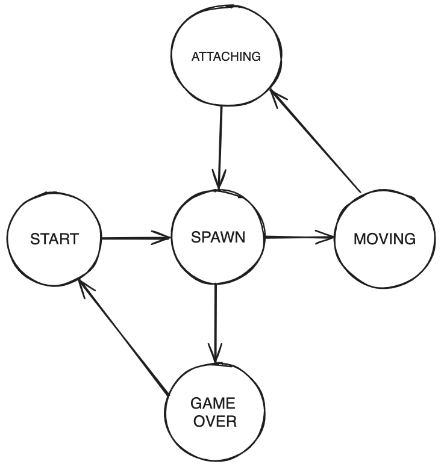

# BrickGame v1.0 aka Tetris

BrickGame v1.0 is a Tetris game designed for terminal, created in the C programming language with the ncurses library. It offers the traditional Tetris gameplay along with features like scoring, advancing levels, and keeping track of high scores.

## Features

- Classic Tetris gameplay with the following mechanics:
    - Tetrominoes Rotation (even near the walls of the well)
    - Horizontal movement of tetrominoes
    - Accelerated tetromino falling (by holding the down arrow key)
    - Display of the next tetromino
    - Line clearing (up to 4)
    - Game over when the tetromino reaches the top of the well
- Support for all physical buttons on the console:
    - Start game - Enter
    - Pause - P
    - End game - Esc
    - Left arrow - move tetromino left
    - Right arrow - move tetromino right
    - Down arrow - accelerate tetromino falling
    - Up arrow - rotate tetromino (R-key also available to rotate the figure)
- Matrix-based game field with dimensions corresponding to the console's size (10x20 pixels)
- Proper stopping of tetrominoes after reaching the bottom or colliding with another tetromino
- Unit tests for the game logic library, achieving at least 80% code coverage

### Score Calculation

- 1 line cleared: 100 points
- 2 lines cleared: 300 points
- 3 lines cleared: 700 points
- 4 lines cleared: 1500 points

### High Score Tracking

- Display of the player's current score and highest score achieved
- Highest score is stored in a file and persists between game sessions

### Level Progression

- Progression of levels every 600 points
- Increasing level increases the speed of tetromino falling

## Installation

1. Clone the repository.
2. Navigate to the `src/` directory.
3. Run `make install` to install the project.
4. Run `make rungame` to start playing.

Or just use `make all` to install and run the game.

## Usage

- Use the arrow keys to move and rotate tetrominoes.
- Press the down arrow key to make tetrominoes fall faster.
- Press the up arrow key to rotate tetrominoes.

## Finite State Machine (FSM) Diagram

